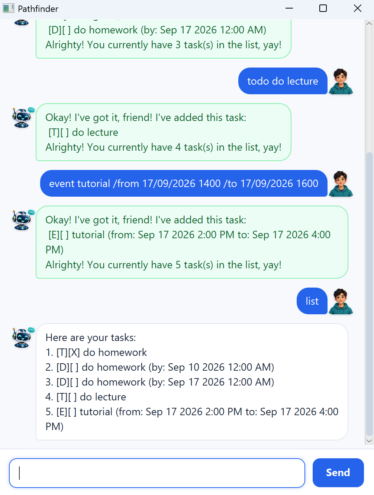

# Pathfinder User Guide

**Pathfinder** is a friendly task chatbot that helps you keep track of todos,
deadlines, events, and task priorities.



## Setting up and running Pathfinder

### Prerequisites

Ensure that Java 25 is installed on your computer.

To check your Java version, open a terminal and run:

```text
java -version
```

### Download the application

1. Download `pathfinder.jar` from this project's GitHub Releases page.
2. Save it in a folder where you would like Pathfinder to keep its data.

### Run Pathfinder

Open a terminal in the folder containing the JAR file and run:

```text
java -jar pathfinder.jar
```

The Pathfinder window should appear.

> Note: Pathfinder saves your tasks locally. Keep the JAR in the same folder
> between uses so that it can continue to access your saved task data.

## Quick start

1. Open Pathfinder.
2. Type a command in the input box at the bottom of the window.
3. Press <kbd>Enter</kbd> or select **Send**.
4. Use `list` whenever you want to see all saved tasks.

## Command summary

| Action | Command format |
| --- | --- |
| Add a todo | `todo DESCRIPTION` |
| Add a deadline | `deadline DESCRIPTION /by DATE [TIME]` |
| Add an event | `event DESCRIPTION /from START_DATE [TIME] /to END_DATE [TIME]` |
| List tasks | `list` |
| Mark a task done | `mark TASK_NUMBER` |
| Mark a task not done | `unmark TASK_NUMBER` |
| Delete a task | `delete TASK_NUMBER` |
| Find tasks | `find KEYWORD` |
| Set priority | `priority TASK_NUMBER LEVEL` |
| Say goodbye | `bye` |

Task numbers are the numbers shown by the `list` command.

## Adding tasks

### Todos

Use a todo for a task without a date or time.

```text
todo read the textbook
```

### Deadlines

Use a deadline for a task that must be completed by a specific date or time.

```text
deadline submit assignment /by 2026-09-20 2359
```

### Events

Use an event for something with both a start and end date/time.

```text
event project meeting /from 2026-09-17 1400 /to 2026-09-17 1600
```

The end date/time must be after the start date/time.

### Supported date formats

Use either of these date formats:

```text
yyyy-MM-dd
d/M/yyyy
```

Time is optional. When included, use 24-hour `HHmm` format.

```text
deadline birthday /by 17/9/2026
deadline presentation /by 2026-09-17 1400
```

## Viewing and finding tasks

### Listing tasks

```text
list
```

Pathfinder displays every task with its number, type, completion status, and
priority where applicable.

### Finding tasks

Search task descriptions without regard to letter case.

```text
find book
```

## Updating tasks

### Marking a task as done

```text
mark 1
```

### Marking a task as not done

```text
unmark 1
```

### Deleting a task

```text
delete 1
```

## Prioritizing tasks

Use `priority TASK_NUMBER LEVEL` to assign a priority to a task.

Supported levels are `high`, `medium`, `low`, and `none`.

```text
priority 1 high
priority 2 medium
priority 3 none
```

Priority levels are case-insensitive. Use `none` to remove a priority.

## Saving data

Pathfinder saves tasks automatically after task-changing commands. Your saved
tasks are loaded the next time you open the application.

## Handling mistakes

Pathfinder explains common command mistakes, including:

- Missing descriptions or required parameters.
- Invalid task numbers.
- Unsupported date formats or impossible dates.
- Event end times that are not after start times.
- Repeated `/by`, `/from`, or `/to` parameters.
- Duplicate tasks.

Check the command format and try again when Pathfinder shows an `Oopsies!`
message.
